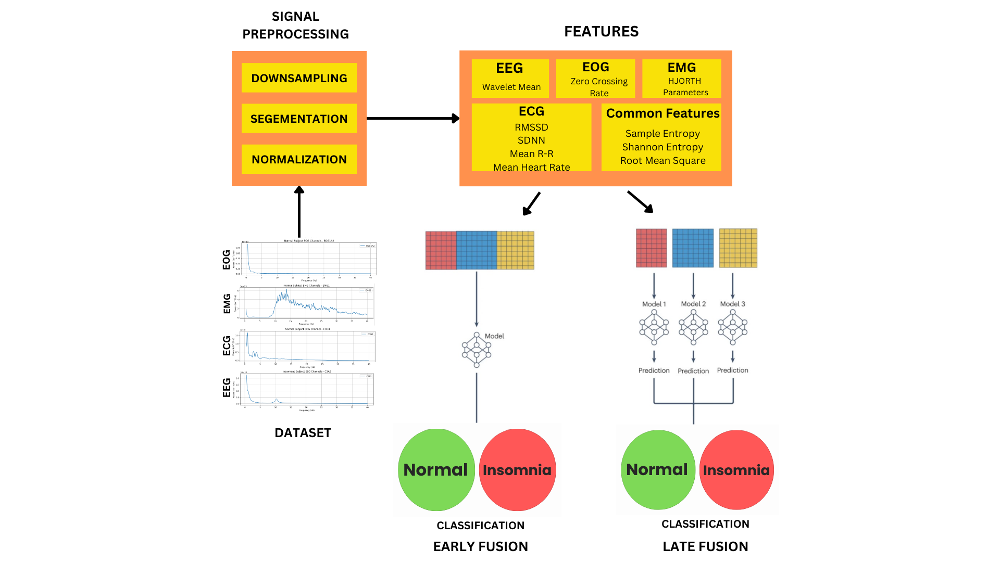

# 🧠 Multimodal Fusion Framework for Accurate Insomnia Detection

## 📄 Abstract

Insomnia, a prevalent sleep disorder, adversely impacts cognitive and physical health, highlighting the need for accurate and efficient diagnostic tools. This study employs multimodal biosignal analysis, integrating **EEG**, **EMG**, **EOG**, and **ECG** to classify individuals as insomniac or non-insomniac. Preprocessing techniques, such as **resampling**, are applied to reduce computational load, followed by **feature extraction methods** tailored to each signal modality. These methods capture **frequency-domain**, **time-domain**, and **entropy metrics**, which reveal physiological traits associated with insomnia, such as irregular brain activity, altered muscle atonia, and abnormal eye movements.

**Early and late fusion techniques** are employed for the classification task—early fusion achieved a better accuracy of **95%**, compared to **92.275%** for late fusion, with the highest overall **F1 score of 95%**. Explainable AI (XAI) concepts such as **LIME** (Local Interpretable Model-Agnostic Explanations) and **SHAP** (Shapley Additive Explanations) were used to determine the most influential features in classification. By leveraging multimodal data fusion, this methodology captures intricate physiological interactions to improve disease diagnosis and provides a **non-invasive, interpretable detection** of insomnia—paving the way for enhanced therapeutic interventions.

---

## 📁 Repository Structure

| File/Folder | Description |
|-------------|-------------|
| `BSP_1.ipynb` | Baseline models for individual signal modalities |
| `BSP_1_EarlyFusion.ipynb` | Implementation of Early Fusion strategy |
| `BSP_1_LateFusion.ipynb` | Implementation of Late Fusion strategy |
| `BSP-ATT.ipynb` | Attention-based fusion modeling |
| `Norm_BSP_1_EarlyFusion.ipynb` | Normalized Early Fusion model |
| `BSP_XAI.ipynb` | Explainable AI using LIME and SHAP |
| `combined_data.xlsx` | Dataset with extracted features |
| `csv_output/` | Folder for result/output files |
| `README.md` | Project documentation |

---

## 🧪 Dataset Description

The dataset used is sourced from the **Sleep Disorders Research Center (SDRC)**. It contains recordings of 22 subjects (11 normal + 11 insomniac), sampled at **256 Hz**, including:

- **EEG (14 channels)**
- **EOG (6 channels)**
- **EMG (3 channels)**
- **ECG (1 channel)**

Data was downsampled to 32 Hz and segmented into 60-second overlapping epochs for efficient processing and analysis.

---

## 🔬 Methodology

### 🔄 Data Preprocessing
- **Downsampling** to 32 Hz
- **Epoch segmentation** (60s windows with 10s overlap)

### 📊 Feature Extraction
Each modality has tailored feature extraction methods:
- **EEG:** Wavelet Coefficients, Spectral Entropy, Sample Entropy, RMS
- **ECG:** HRV metrics (mean RR, SDNN, RMSSD), Entropy, RMS
- **EOG:** Zero-Crossing Rate, Entropy, RMS
- **EMG:** Hjorth Parameters, Entropy, RMS

### 🤖 Fusion Techniques
- **Early Fusion:** Combines all modality features before model input
- **Late Fusion:** Combines predictions from modality-specific models
- **Voting Classifier** used for late fusion aggregation
- Models used: SVM, Random Forest, Gradient Boosting, KNN, AdaBoost, MLP, Extra Trees, SGD, Logistic Regression

---

## 🧠 Explainable AI (XAI)

To enhance interpretability:
- **LIME** explains individual predictions and highlights contributing features
- **SHAP** provides global and local interpretability of model outputs
- Both methods emphasize the importance of **ECG and EMG features** in classification

---

## 📊 Performance Summary

| Method         | Accuracy | Precision | Recall | F1 Score |
|----------------|----------|-----------|--------|----------|
| Early Fusion   | 95%      | 94%       | 97%    | 95%      |
| Late Fusion    | 92%      | 91%       | 93%    | 92%      |
| Best Classifiers | Random Forest, MLP, Extra Trees | All with 95% Accuracy |

---

## 🧭 Workflow

>   
> _Figure: Overall workflow for data preparation, feature extraction, fusion, classification, and explainability._

---

## 🧰 Setup Instructions

### 📦 Requirements
- Python 3.8+
- `numpy`, `pandas`, `matplotlib`, `scikit-learn`, `scipy`
- XAI: `lime`, `shap`
- Jupyter Notebook or Google Colab

